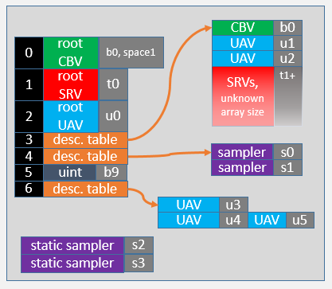

# Root Signatures

A root signature can be specified in HLSL as a string. The string contains a collection of comma-separated clauses that describe root signature constituent components. The root signature should be identical across shaders for any one pipeline state object (PSO). Here is an example:

## Root Signature Version 1.0

```syntax
#define MyRS1 "RootFlags( ALLOW_INPUT_ASSEMBLER_INPUT_LAYOUT | " \
                         "DENY_VERTEX_SHADER_ROOT_ACCESS), " \
              "CBV(b0, space = 1), " \
              "SRV(t0), " \
              "UAV(u0, visibility = SHADER_VISIBILITY_GEOMETRY), " \
              "DescriptorTable( CBV(b0), " \
                               "UAV(u1, numDescriptors = 2), " \
                               "SRV(t1, numDescriptors = unbounded)), " \
              "DescriptorTable(Sampler(s0, numDescriptors = 2)), " \
              "RootConstants(num32BitConstants=1, b9), " \
              "DescriptorTable( UAV(u3), " \
                               "UAV(u4), " \
                               "UAV(u5, offset=1)), " \

              "StaticSampler(s2)," \
              "StaticSampler(s3, " \
                             "addressU = TEXTURE_ADDRESS_CLAMP, " \
                             "filter = FILTER_MIN_MAG_MIP_LINEAR )"
```

This definition would give the following root signature, noting:

- The use of default parameters.
- b0 and (b0, space=1) do not conflict.
- u0 is only visible to the geometry shader.
- u4 and u5 are aliased to the same descriptor in the heap.



## Root Signature Version 1.1

Root Signature Version 1.1 enables driver optimizations on root signature descriptors and data.

```syntax
#define MyRS1 "RootFlags( ALLOW_INPUT_ASSEMBLER_INPUT_LAYOUT | " \
                         "DENY_VERTEX_SHADER_ROOT_ACCESS), " \
              "CBV(b0, space = 1, flags = DATA_STATIC), " \
              "SRV(t0), " \
              "UAV(u0), " \
              "DescriptorTable( CBV(b1), " \
                               "SRV(t1, numDescriptors = 8, " \
                               "        flags = DESCRIPTORS_VOLATILE), " \
                               "UAV(u1, numDescriptors = unbounded, " \
                               "        flags = DESCRIPTORS_VOLATILE)), " \
              "DescriptorTable(Sampler(s0, space=1, numDescriptors = 4)), " \
              "RootConstants(num32BitConstants=3, b10), " \
              "StaticSampler(s1)," \
              "StaticSampler(s2, " \
                             "addressU = TEXTURE_ADDRESS_CLAMP, " \
                             "filter = FILTER_MIN_MAG_MIP_LINEAR )"
```

The HLSL root signature language closely corresponds to the C++ root signature APIs and has equivalent expressive power. The root signature is specified as a sequence of clauses, separated by comma. The order of clauses is important, as the order of parsing determines the slot position in the root signature. Each clause takes one or more named parameters. The order of parameters is not important, however.

## RootFlags

The optional *RootFlags* clause takes either 0 (the default value to indicate no flags), or one or several of predefined root flags values, connected via the OR ‘\|’ operator. The allowed root flag values are defined by [**D3D12\_ROOT\_SIGNATURE\_FLAGS**](/windows/desktop/api/d3d12/ne-d3d12-d3d12_root_signature_flags).

For example:

``` syntax
RootFlags(0) // default value – no flags
RootFlags(ALLOW_INPUT_ASSEMBLER_INPUT_LAYOUT)
RootFlags(ALLOW_INPUT_ASSEMBLER_INPUT_LAYOUT | DENY_VERTEX_SHADER_ROOT_ACCESS)
```

## Root Constants

The *RootConstants* clause specifies root constants in the root signature. Two mandatory parameters are: *num32BitConstants* and *bReg* (the register corresponding to *BaseShaderRegister* in C++ APIs) of the *cbuffer*. The space (*RegisterSpace* in C++ APIs) and visibility (*ShaderVisibility* in C++) parameters are optional, and the default values are:

``` syntax
RootConstants(num32BitConstants=N, bReg [, space=0, 
              visibility=SHADER_VISIBILITY_ALL ])
```

For example:

``` syntax
RootConstants(num32BitConstants=3, b3)
```